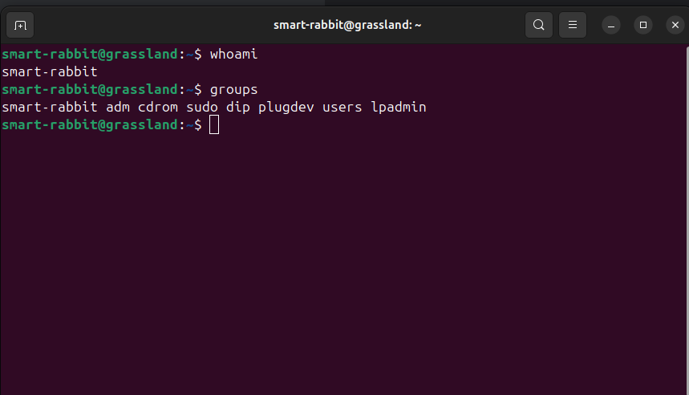
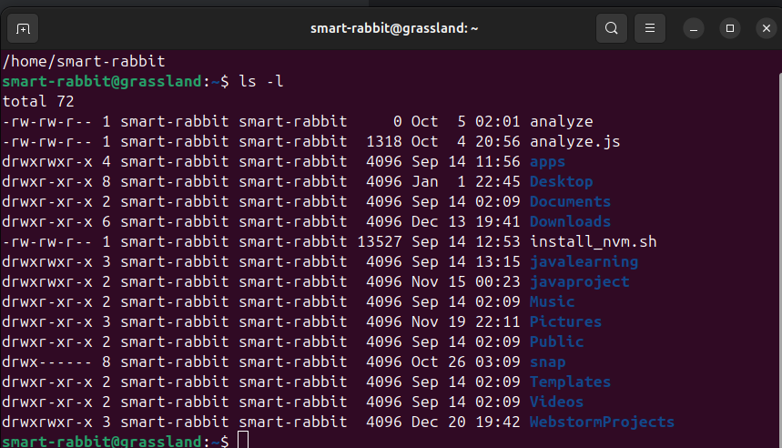
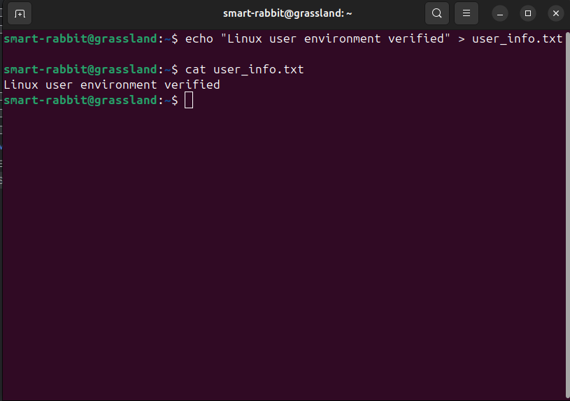
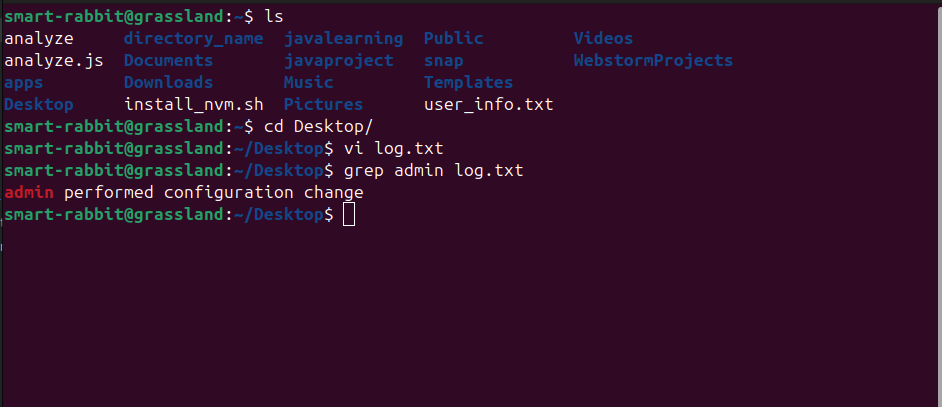
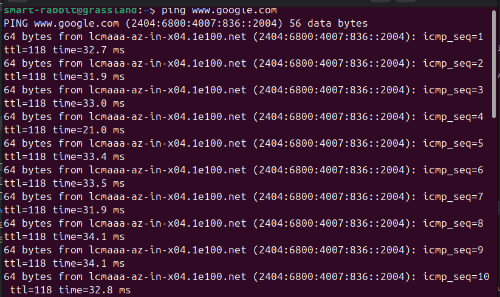

## 1. User Identity Verification

### Commands used
```command
whoami
groups
```

### Explanation
`whoami` command shows the current user. My current user is `smart-rabbit`

`groups` command shows the groups that the current user belongs to. My current user belongs to `smart-rabbit adm cdrom sudo dip plugdev users lpadmin` groups.

## 2. Workspace Validation

### Commands used
```command
pwd
ls -l
```
### Output

```terminaloutput
smart-rabbit@grassland:~$ pwd
/home/smart-rabbit
smart-rabbit@grassland:~$ ls -l
total 72
-rw-rw-r-- 1 smart-rabbit smart-rabbit     0 Oct  5 02:01 analyze
-rw-rw-r-- 1 smart-rabbit smart-rabbit  1318 Oct  4 20:56 analyze.js
drwxrwxr-x 4 smart-rabbit smart-rabbit  4096 Sep 14 11:56 apps
drwxr-xr-x 8 smart-rabbit smart-rabbit  4096 Jan  1 22:45 Desktop
drwxr-xr-x 2 smart-rabbit smart-rabbit  4096 Sep 14 02:09 Documents
drwxr-xr-x 6 smart-rabbit smart-rabbit  4096 Dec 13 19:41 Downloads
-rw-rw-r-- 1 smart-rabbit smart-rabbit 13527 Sep 14 12:53 install_nvm.sh
drwxrwxr-x 3 smart-rabbit smart-rabbit  4096 Sep 14 13:15 javalearning
drwxrwxr-x 2 smart-rabbit smart-rabbit  4096 Nov 15 00:23 javaproject
drwxr-xr-x 2 smart-rabbit smart-rabbit  4096 Sep 14 02:09 Music
drwxr-xr-x 3 smart-rabbit smart-rabbit  4096 Nov 19 22:11 Pictures
drwxr-xr-x 2 smart-rabbit smart-rabbit  4096 Sep 14 02:09 Public
drwx------ 8 smart-rabbit smart-rabbit  4096 Oct 26 03:09 snap
drwxr-xr-x 2 smart-rabbit smart-rabbit  4096 Sep 14 02:09 Templates
drwxr-xr-x 2 smart-rabbit smart-rabbit  4096 Sep 14 02:09 Videos
drwxrwxr-x 3 smart-rabbit smart-rabbit  4096 Dec 20 19:42 WebstormProjects
```



### Explanation
`pwd` Displays the present working directory

`ls -l` Lists all files and directories in long format, showing permissions, owner, size, and modification date

## 3. Environment Confirmation File

### Command used
```command
echo "Linux user environment verified" > user_info.txt
cat user_info.txt
```
### Output

```terminalOutput
smart-rabbit@grassland:~$ echo "Linux user environment verified" > user_info.txt 
smart-rabbit@grassland:~$ cat user_info.txt
Linux user environment verified
```


### Explanation
`echo` command writes the given text into the file user_info.txt, confirming the Linux user environment. 

`Cat` command is used to verify the content of the file.

## 4. File Integrity check

### Command used

```commands
wc -m user_info.txt
```
### Output

```terminaloutput
smart-rabbit@grassland:~$ wc -m user_info.txt
32 user_info.txt
```


### Explanation
`wc -m` command counts the number of characters in the file.

## 5. Learning the tool

### Command used
```Commands
man mkdir
mkdir -p parent1/parent2/child
```
### Output
```terminaloutput
MKDIR(1)                         User Commands                        MKDIR(1)

NAME
       mkdir - make directories

SYNOPSIS
       mkdir [OPTION]... DIRECTORY...

DESCRIPTION
       Create the DIRECTORY(ies), if they do not already exist.

       Mandatory  arguments  to  long  options are mandatory for short options
       too.

       -m, --mode=MODE
              set file mode (as in chmod), not a=rwx - umask

       -p, --parents
              no error if existing, make parent directories  as  needed,  with
              their file modes unaffected by any -m option.

       -v, --verbose
              print a message for each created directory
 Manual page mkdir(1) line 1 (press h for help or q to quit)

```


### Explanation
`man` command displays the manual page of the `mkdir` command.

`-p option` is identified as a useful option. It creates parent directories if they do not exist and prevents errors if the directory already exists.

## 6. Home Directory Inspection

### Commands used
```Commands
ls ~
```
### Output
```terminaloutput
smart-rabbit@grassland:~$ ls ~
analyze     apps     directory_name  Downloads       javalearning  Music     Public  Templates      Videos
analyze.js  Desktop  Documents       install_nvm.sh  javaproject   Pictures  snap    user_info.txt  WebstormProjects
```


### Explanation
`ls ~` command lists the contents of the home directory and alphabetical sorting is the default behavior.

## 7. Log Investigation

### Commands used
```Commands
vi log.txt
grep admin log.txt
```
### Output
```terminaloutput
smart-rabbit@grassland:~$ cd Desktop/
smart-rabbit@grassland:~/Desktop$ vi log.txt
smart-rabbit@grassland:~/Desktop$ grep admin log.txt
admin performed configuration change
```



### Explanation
`vi` command creates and opens the log.txt file in the vi editor.

`grep` command is used to search for a specific word inside a file.

## 8. System Information Check

### Command used
```Commands
uname -r
```
### Output
```terminaloutput
smart-rabbit@grassland:~$ uname -r
6.14.0-37-generic
```


### Explanation
`uname` command displays information about the current kernel.

## 9. Network Connectivity Test
### Commands used
```Commands
ping www.google.com
```
### Output
```terminaloutput
smart-rabbit@grassland:~$ ping www.google.com
PING www.google.com (2404:6800:4007:836::2004) 56 data bytes
64 bytes from lcmaaa-az-in-x04.1e100.net (2404:6800:4007:836::2004): icmp_seq=1 ttl=118 time=32.7 ms
64 bytes from lcmaaa-az-in-x04.1e100.net (2404:6800:4007:836::2004): icmp_seq=2 ttl=118 time=31.9 ms
64 bytes from lcmaaa-az-in-x04.1e100.net (2404:6800:4007:836::2004): icmp_seq=3 ttl=118 time=33.0 ms
64 bytes from lcmaaa-az-in-x04.1e100.net (2404:6800:4007:836::2004): icmp_seq=4 ttl=118 time=21.0 ms
64 bytes from lcmaaa-az-in-x04.1e100.net (2404:6800:4007:836::2004): icmp_seq=5 ttl=118 time=33.4 ms
64 bytes from lcmaaa-az-in-x04.1e100.net (2404:6800:4007:836::2004): icmp_seq=6 ttl=118 time=33.5 ms
64 bytes from lcmaaa-az-in-x04.1e100.net (2404:6800:4007:836::2004): icmp_seq=7 ttl=118 time=31.9 ms
64 bytes from lcmaaa-az-in-x04.1e100.net (2404:6800:4007:836::2004): icmp_seq=8 ttl=118 time=34.1 ms
64 bytes from lcmaaa-az-in-x04.1e100.net (2404:6800:4007:836::2004): icmp_seq=9 ttl=118 time=34.1 ms
64 bytes from lcmaaa-az-in-x04.1e100.net (2404:6800:4007:836::2004): icmp_seq=10 ttl=118 time=32.8 ms
64 bytes from lcmaaa-az-in-x04.1e100.net (2404:6800:4007:836::2004): icmp_seq=11 ttl=118 time=28.8 ms
```



### Explanation
`ping` command sends ICMP echo request packets to the specified host.

## 10. System Health Awareness
### Commands used
```Commands
uptime
```
### Output
```terminaloutput
smart-rabbit@grassland:~$ uptime
 01:39:53 up  3:07,  1 user,  load average: 0.27, 0.42, 0.41
```


### Explanation
`uptime` command displays system load and time since last reboot.
