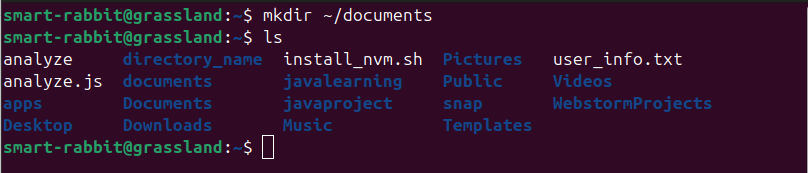
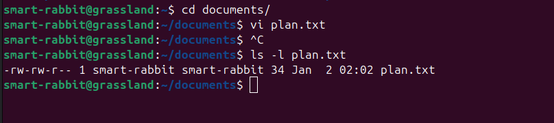
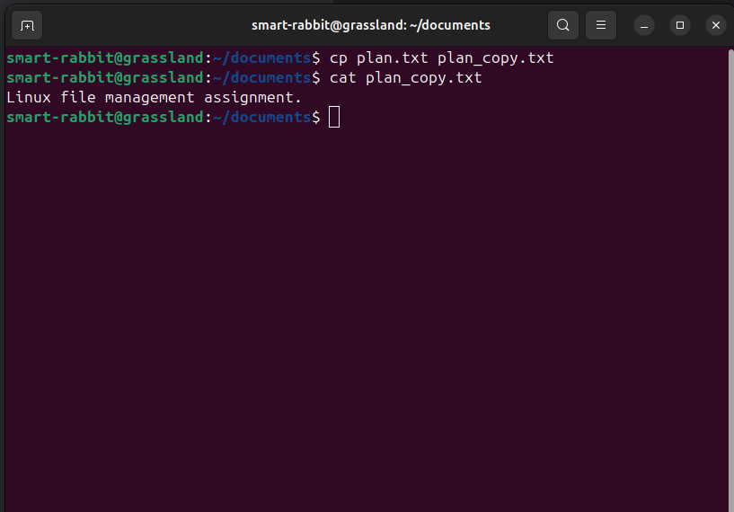
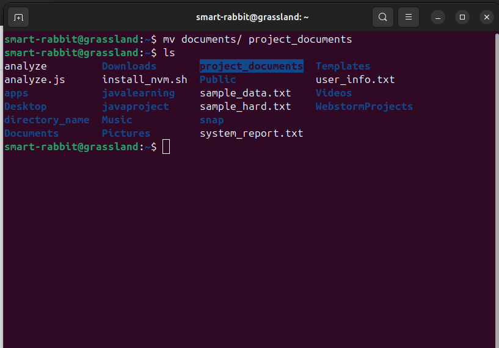
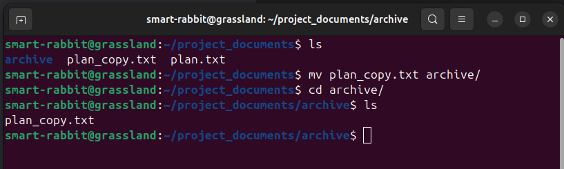
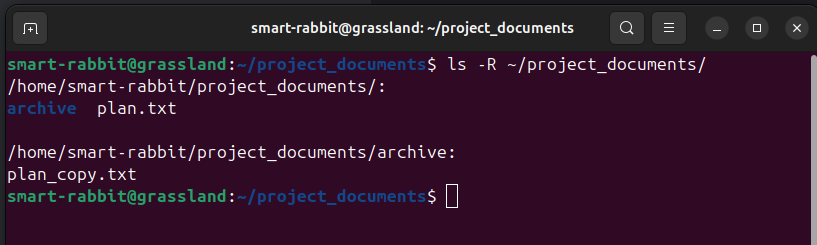
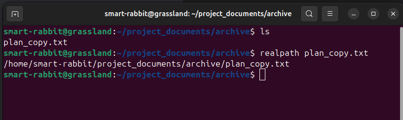

## 1. Project Workspace Setup

### Command used
```Commands
mkdir ~/documents
```
### Output
```terminaloutput
smart-rabbit@grassland:~$ mkdir ~/documents
smart-rabbit@grassland:~$ ls
analyze     directory_name  install_nvm.sh  Pictures   user_info.txt
analyze.js  documents       javalearning    Public     Videos
apps        Documents       javaproject     snap       WebstormProjects
Desktop     Downloads       Music           Templates

```


### Explanation
`mkdir` command creates a new directory with the specified name.

## 2. Project Workspace Inspection

### Command used
```Commands
cd ~/documents
touch plan.txt
```
### Output
```terminaloutput
smart-rabbit@grassland:~$ cd documents/
smart-rabbit@grassland:~/documents$ touch plan.txt
smart-rabbit@grassland:~/documents$ ls
plan.txt
smart-rabbit@grassland:~/documents$ 
```


### Explanation
`cd` command is used to navigate into the documents directory.

`touch` command is used to create an empty file named plan.txt.

## 3. Content Addition

### Command used
```Commands
vi plan.txt
```

### Output
```terminaloutput
smart-rabbit@grassland:~$ cd documents/
smart-rabbit@grassland:~/documents$ vi plan.txt
smart-rabbit@grassland:~/documents$ cat plan.txt
Linux file management assignment.
smart-rabbit@grassland:~/documents$ 
```


### Explanation
`vi` command is used to open the file in the vi editor.

## 4. File Metadata Verification

### Command used
```Commands
ls -l plan.txt
```
### Output
```terminaloutput
smart-rabbit@grassland:~/documents$ ls -l plan.txt
-rw-rw-r-- 1 smart-rabbit smart-rabbit 34 Jan  2 02:02 plan.txt
```


### Explanation
`ls -l` command lists the contents of the specified directory along with detailed file information.

## 5. File Duplication

### Command used
```command
cp plan.txt plan_copy.txt
cat plan_copy.txt
```

### Output
```command
smart-rabbit@grassland:~/documents$ cp plan.txt plan_copy.txt
smart-rabbit@grassland:~/documents$ cat plan_copy.txt 
Linux file management assignment.
```


### Explanation
`cp` command is used to copy files.

## 6. Directory Renaming

### Command used
```Commands
cd ~
mv documents project_documents
```
### Output
```terminaloutput
smart-rabbit@grassland:~/documents$ cd ~
smart-rabbit@grassland:~$ mv documents project_documents
smart-rabbit@grassland:~$ ls
analyze     directory_name  javalearning  project_documents  user_info.txt
analyze.js  Documents       javaproject   Public              Videos
apps        Downloads       Music         snap                WebstormProjects
Desktop     install_nvm.sh  Pictures      Templates
```


### Explanation
`mv` command is used to rename or move a file or directory.

## 7. Archival Structure

### Command used
```Commands
mkdir archive
```
### Output
```terminaloutput
smart-rabbit@grassland:~/project_documents$ mkdir archive
smart-rabbit@grassland:~/project_documents$ ls
archive  plan.txt plan_copy.txt
```


### Explanation
`mkdir` A subdirectory named archive is created inside project_documents

## 8. File Organization

### Command used
```Commands
mv plan_copy.txt archive/
```
### Output
```terminaloutput
smart-rabbit@grassland:~/project_documents$ ls
archive  plan.txt plan_copy.txt
smart-rabbit@grassland:~/project_documents$ mv plan_copy.txt archive/
smart-rabbit@grassland:~/project_documents$ cd archive/
smart-rabbit@grassland:~/project_documents/archive$ ls
plan_copy.txt
smart-rabbit@grassland:~/project_documents/archive$ 
```


### Explanation
`mv` command is used to move files between directories.

## 9. Recursive Listing

### Command used
```Commands
ls -R ~/project_documents
```
### Output
```terminaloutput
smart-rabbit@grassland:~/project_documents$ ls -R ~/project_documents/
/home/smart-rabbit/project_documents/:
archive  plan.txt

/home/smart-rabbit/project_documents/archive:
plan_copy.txt
```


### Explanation
`ls -R` lists all files and subdirectories recursively, displaying the complete directory structure of project_documents.

## 10. Path Verification

### Command used
```Commands
realpath plan_copy.txt
```
### Output
```terminaloutput
smart-rabbit@grassland:~/project_documents/archive$ ls
plan_copy.txt
smart-rabbit@grassland:~/project_documents/archive$ realpath plan_copy.txt 
/home/smart-rabbit/project_documents/archive/plan_copy.txt
```

### Explanation
`realpath` command displays the absolute path of the specified file.