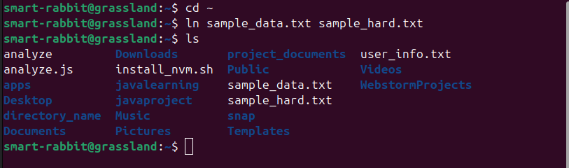
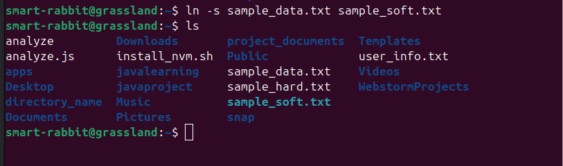
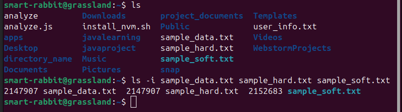
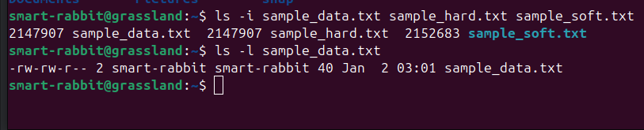
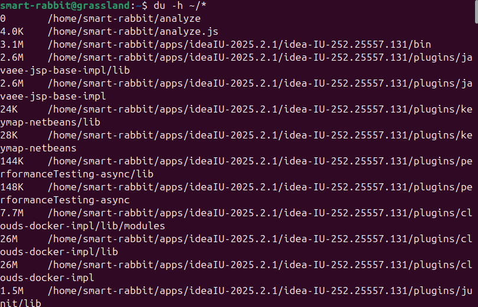
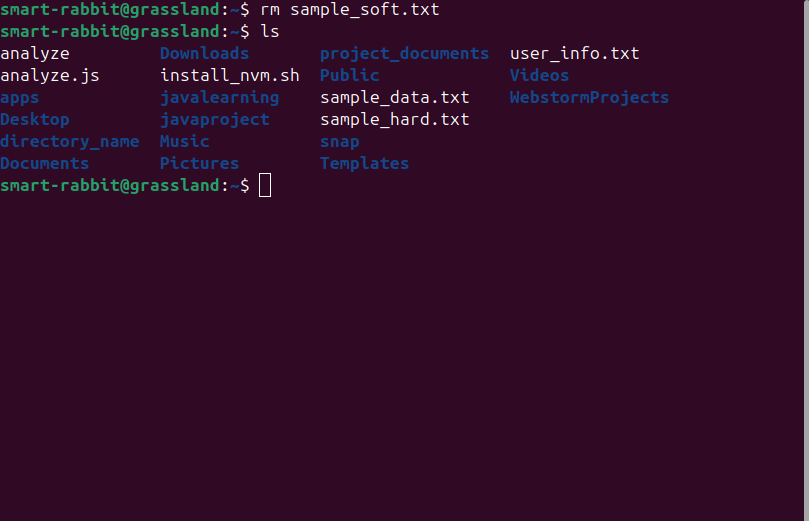
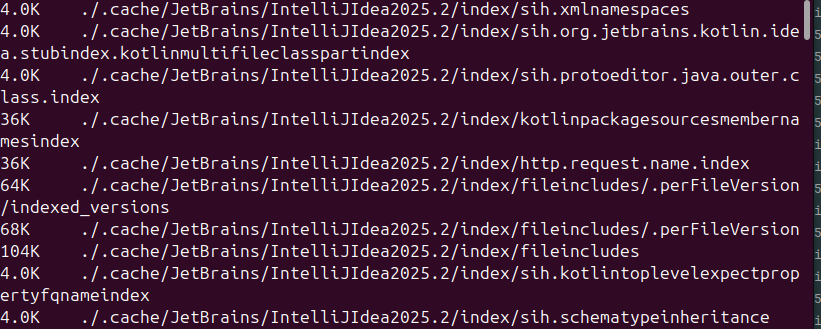
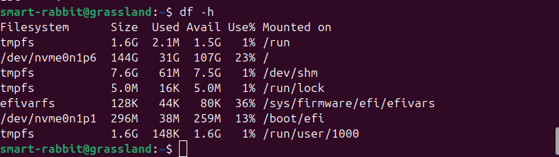

## 1. File Creation

### Command used
```Commands
cd ~
vi sample_data.txt
```
### Output
```terminaloutput
smart-rabbit@grassland:~$ cd ~
smart-rabbit@grassland:~$ vi sample.txt
smart-rabbit@grassland:~$ cat sample.txt
Here is sample text for the assignment.
```


### Explanation
`vi` A file named sample_data.txt is created in the home directory and added sample text to it.

## 2. Hard Link Creation

### Command used
```Commands
ln sample_data.txt sample_hard.txt
```
### Output
```terminaloutput
smart-rabbit@grassland:~$ cd ~
smart-rabbit@grassland:~$ ln sample_data.txt sample_hard.txt
smart-rabbit@grassland:~$ ls
analyze         Downloads       project_documents  user_info.txt
analyze.js      install_nvm.sh  Public             Videos
apps            javalearning    sample_data.txt    WebstormProjects
Desktop         javaproject     sample_hard.txt
directory_name  Music           snap
Documents       Pictures        Templates

```


### Explanation
`ln` command is used to create a hard link.

## 3. Symbolic Link Creation

### Command used
```Commands
ln -s sample_data.txt sample_soft.txt
```
### Output
```terminaloutput
smart-rabbit@grassland:~$ ln -s sample_data.txt sample_soft.txt
smart-rabbit@grassland:~$ ls
analyze         Downloads       project_documents  Templates
analyze.js      install_nvm.sh  Public             user_info.txt
apps            javalearning    sample_data.txt    Videos
Desktop         javaproject     sample_hard.txt    WebstormProjects
directory_name  Music           sample_soft.txt
Documents       Pictures        snap
smart-rabbit@grassland:~$ 
```


### Explanation
`ln -s` command is used to create a symbolic link.

## 4. Inode Verification
### Command used
```Commands
ls -i sample_data.txt sample_hard.txt sample_soft.txt
```
### Output
```terminaloutput
smart-rabbit@grassland:~$ ls -i sample_data.txt sample_hard.txt sample_soft.txt
2147907 sample_data.txt  2147907 sample_hard.txt  2152683 sample_soft.txt
```


### Explanation
`ls -i` command is used to verify the inode number of the files.

## 5. Inode Analysis

### Explanation
`sample_data.txt` and `sample_hard.txt` share the same inode number because a hard link points directly to the same inode and data blocks on disk.


`sample_soft.txt` has a different inode number because a symbolic link has its own inode and only stores the path to the original file.

## 6. File Metadata Inspection

### Command used
```Commands
ls -l sample_data.txt
```
### Output
```terminaloutput
smart-rabbit@grassland:~$ ls -l sample_data.txt
-rw-rw-r-- 2 smart-rabbit smart-rabbit 40 Jan  2 03:01 sample_data.txt
```


### Explanation
`ls -l` command is used to inspect the file metadata.

## 7. Disk Usage Check

### Command used
```Commands
du -sh ~
```
### Output
```terminaloutput
smart-rabbit@grassland:~$ du -sh ~
15G	/home/smart-rabbit
smart-rabbit@grassland:~$ 
```


### Explanation
`du -sh` command is used to check the disk usage.

## 8. File Size Overview

### Command used
```Commands
du -h ~/*
```
### Output
```terminaloutput
smart-rabbit@grassland:~$ du -h ~/*
0	/home/smart-rabbit/analyze
4.0K	/home/smart-rabbit/analyze.js
3.1M	/home/smart-rabbit/apps/ideaIU-2025.2.1/idea-IU-252.25557.131/bin
2.6M	/home/smart-rabbit/apps/ideaIU-2025.2.1/idea-IU-252.25557.131/plugins/javaee-jsp-base-impl/lib
2.6M	/home/smart-rabbit/apps/ideaIU-2025.2.1/idea-IU-252.25557.131/plugins/javaee-jsp-base-impl
24K	/home/smart-rabbit/apps/ideaIU-2025.2.1/idea-IU-252.25557.131/plugins/keymap-netbeans/lib
28K	/home/smart-rabbit/apps/ideaIU-2025.2.1/idea-IU-252.25557.131/plugins/keymap-netbeans
144K	/home/smart-rabbit/apps/ideaIU-2025.2.1/idea-IU-252.25557.131/plugins/performanceTesting-async/lib
148K	/home/smart-rabbit/apps/ideaIU-2025.2.1/idea-IU-252.25557.131/plugins/performanceTesting-async
7.7M	/home/smart-rabbit/apps/ideaIU-2025.2.1/idea-IU-252.25557.131/plugins/clouds-docker-impl/lib/modules
26M	/home/smart-rabbit/apps/ideaIU-2025.2.1/idea-IU-252.25557.131/plugins/clouds-docker-impl/lib
...........
```


### Explanation
`du -h ~/*` This command displays the size of each file and directory in the home directory in a human-readable format.

## 9. Link Deletion Test

### Command used
```Commands
rm sample_soft.txt
```
### Output
```terminaloutput
smart-rabbit@grassland:~$ rm sample_soft.txt
smart-rabbit@grassland:~$ ls
analyze         Downloads       project_documents  user_info.txt
analyze.js      install_nvm.sh  Public             Videos
apps            javalearning    sample_data.txt    WebstormProjects
Desktop         javaproject     sample_hard.txt
directory_name  Music           snap
Documents       Pictures        Templates
smart-rabbit@grassland:~$ 
```


### Explanation
`rm` command is used to delete the symbolic link.

## 10. Disk Utility Demonstration

### Command used
```Commands
du -h
df -h
```
### Output
```terminaloutput
4.0K	./.cache/JetBrains/IntelliJIdea2025.2/index/sih.xmlnamespaces
4.0K	./.cache/JetBrains/IntelliJIdea2025.2/index/sih.org.jetbrains.kotlin.idea.stubindex.kotlinmultifileclasspartindex
4.0K	./.cache/JetBrains/IntelliJIdea2025.2/index/sih.protoeditor.java.outer.class.index
36K	./.cache/JetBrains/IntelliJIdea2025.2/index/kotlinpackagesourcesmembernamesindex
36K	./.cache/JetBrains/IntelliJIdea2025.2/index/http.request.name.index
64K	./.cache/JetBrains/IntelliJIdea2025.2/index/fileincludes/.perFileVersion/indexed_versions
68K	./.cache/JetBrains/IntelliJIdea2025.2/index/fileincludes/.perFileVersion
104K	./.cache/JetBrains/IntelliJIdea2025.2/index/fileincludes
4.0K	./.cache/JetBrains/IntelliJIdea2025.2/index/sih.kotlintoplevelexpectpropertyfqnameindex
4.0K	./.cache/JetBrains/IntelliJIdea2025.2/index/sih.schematypeinheritance
36K	./.cache/JetBrains/IntelliJIdea2025.2/index/editorconfig.index.name
4.0K	./.cache/JetBrains/IntelliJIdea2025.2/index/sih.kotlinprobablycontractedfunctionshortnameindex
4.0K	./.cache/JetBrains/IntelliJIdea2025.2/index/sih.org.jetbrains.kotlin.idea.stubindex.kotlinexactpackagesindex
4.0K	./.cache/JetBrains/IntelliJIdea2025.2/index/sih.xmlproperties
4.0K	./.cache/JetBrains/IntelliJIdea2025.2/index/sih.kotlinpackagesourcesmembernamesindex
4.0K	./.cache/JetBrains/IntelliJIdea2025.2/index/sih.kotlinprobablynothingfunctionshortnameindex
20K	./.cache/JetBrains/IntelliJIdea2025.2/index/stubs/gr.class.super
60K	./.cache/JetBrains/IntelliJIdea2025.2/index/stubs/org.jetbrains.kotlin.idea.stubindex.kotlinpropertyshortnameindex
2.6M	./.cache/JetBrains/IntelliJIdea2025.2/index/stubs/jvm.static.member.name
20K	./.cache/JetBrains/IntelliJIdea2025.2/index/stubs/gr.field.name
676K	./.cache/JetBrains/IntelliJIdea2025.2/index/stubs/java.class.extlist
60K	./.cache/JetBrains/IntelliJIdea2025.2/index/stubs/org.jetbrains.kotlin.idea.stubindex.kotlinexactpackagesindex
60K	./.cache/JetBrains/IntelliJIdea2025.2/index/stubs/kotlintypealiasbyexpansionshortnameindex
756K	./.cache/JetBrains/IntelliJIdea2025.2/index/stubs/java.method.parameter.types
20K	./.cache/JetBrains/IntelliJIdea2025.2/index/stubs/kotlintoplevelpropertybypackageindex
60K	./.cache/JetBrains/IntelliJIdea2025.2/index/stubs/org.jetbrains.kotlin.i
................
```


```terminaloutput
smart-rabbit@grassland:~$ df -h
Filesystem      Size  Used Avail Use% Mounted on
tmpfs           1.6G  2.1M  1.5G   1% /run
/dev/nvme0n1p6  144G   31G  107G  23% /
tmpfs           7.6G   65M  7.5G   1% /dev/shm
tmpfs           5.0M   16K  5.0M   1% /run/lock
efivarfs        128K   44K   80K  36% /sys/firmware/efi/efivars
/dev/nvme0n1p1  296M   38M  259M  13% /boot/efi
tmpfs           1.6G  148K  1.6G   1% /run/user/1000
smart-rabbit@grassland:~$ 
```


### Explanation
`du -h` shows disk usage of files and directories in the current location in human-readable format.

`df -h` displays filesystem disk space usage, showing total size, used space, available space, and mount points.