## 1. System Uptime Verification

### Command used
```Commands
uptime
```
### Output
```terminaloutput
smart-rabbit@grassland:~$ uptime
 03:49:27 up  5:17,  1 user,  load average: 0.42, 0.52, 0.53
smart-rabbit@grassland:~$
```
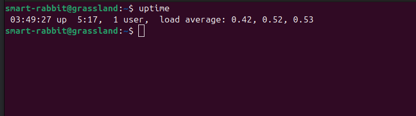

### Explanation
`uptime` command displays how long the system has been running since the last boot, along with user count and load average.

## 2. User Process Listing

### Command used
```Commands
ps -u $USER
```
### Output
```terminaloutput
smart-rabbit@grassland:~$ ps -u $USER
    PID TTY          TIME CMD
   2293 ?        00:00:01 systemd
   2299 ?        00:00:00 (sd-pam)
   2308 ?        00:00:03 pipewire
   2309 ?        00:00:00 pipewire
   2313 ?        00:00:00 wireplumber
   2314 ?        00:00:03 pipewire-pulse
   2316 ?        00:00:00 gnome-keyring-d
   2327 ?        00:00:10 dbus-daemon
   2377 ?        00:00:00 xdg-document-po
   2381 ?        00:00:00 xdg-permission-
..........
```
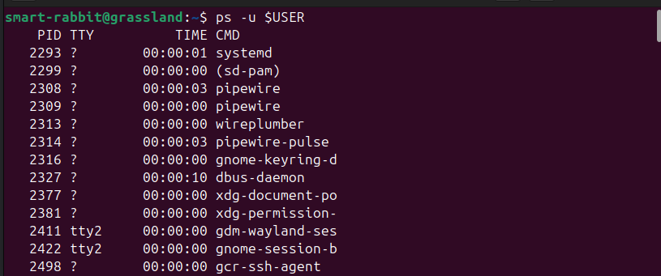

### Explanation
`ps` command lists processes.
`-u $USER` option displays only the processes running under the current user account.

## 3. CPU Usage Analysis

### Command used
```Commands
top -u $USER
```
### Output

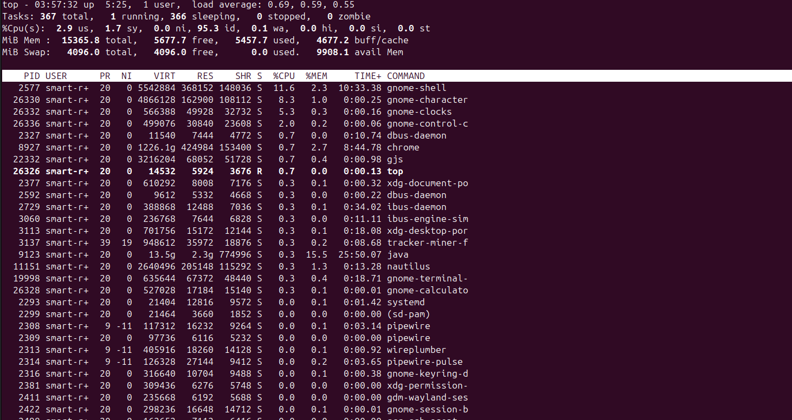

### Explanation
`top` displays real-time process information. The process with the highest CPU usage (%CPU) among the user’s processes appears at the top of the list.

## 4. Background Process Execution

### Command used
```Commands
sleep 300 &
jobs
```
### Output
```terminaloutput
smart-rabbit@grassland:~$ sleep 300 &
[1] 26626
smart-rabbit@grassland:~$ jobs
[1]+  Running                 sleep 300 &
smart-rabbit@grassland:~$ 
```
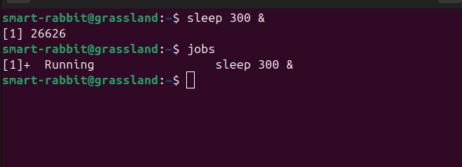

### Explanation
`sleep 300 &` runs a command in the background.
`jobs` command verifies that the background process is currently running.

## 5. Process Priority Management

### Command used
```Commands
ps -u $USER -o pid,ni,cmd
renice 5 -p 3927
ps -o pid,ni,cmd -p 3927
```
### Output
```terminaloutput
   3927   0 /opt/google/chrome/chrome_crashpad_handler --monitor-self --monitor-
   3929   0 /opt/google/chrome/chrome_crashpad_handler --no-periodic-tasks --mon
   3935   0 /opt/google/chrome/chrome --type=zygote --no-zygote-sandbox --crashp
   3936   0 /opt/google/chrome/chrome --type=zygote --crashpad-handler-pid=3927 
   3938   0 /opt/google/chrome/chrome --type=zygote --crashpad-handler-pid=3927 
   3981   0 /opt/google/chrome/chrome --type=gpu-process --ozone-platform=waylan
   3984   0 /opt/google/chrome/chrome --type=utility --utility-sub-type=network.
   3996   0 /opt/google/chrome/chrome --type=utility --utility-sub-type=storage.
   4342   0 /opt/google/chrome/chrome --type=renderer --crashpad-handler-pid=392
   4360   0 /opt/google/chrome/chrome --type=utility --utility-sub-type=audio.mo
   4471   0 /opt/google/chrome/chrome --type=renderer --crashpad-handler-pid=392
   4524   0 /opt/google/chrome/chrome --type=renderer --crashpad-handler-pid=392
   4533   0 /opt/google/chrome/chrome --type=renderer --crashpad-handler-pid=392
```
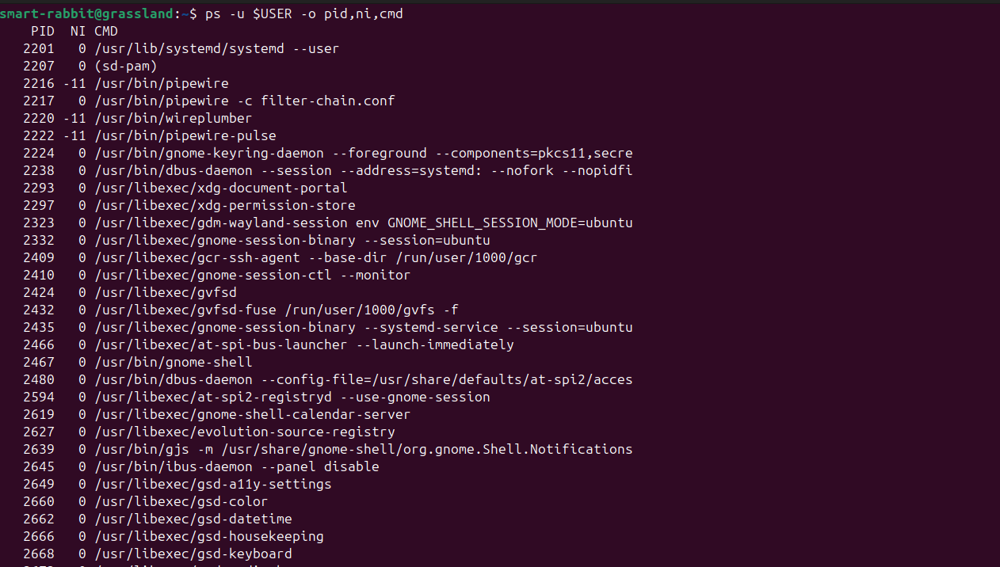

```terminaloutput
smart-rabbit@grassland:~$ renice 5 -p 3927
3927 (process ID) old priority 0, new priority 5
```
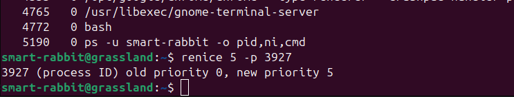
```terminaloutput
smart-rabbit@grassland:~$ ps -o pid,ni,cmd -p 3927
    PID  NI CMD
   3927   5 /opt/google/chrome/chrome_crashpad_handler --monitor-self --monitor-self-annotation=ptype=crashpad-handler --datab
smart-rabbit@grassland:~$ 
```
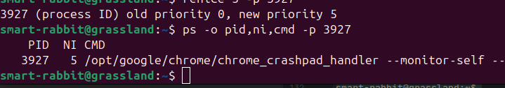

### Explanation
`renice` command changes the priority of a process. The niceness value determines the scheduling priority of the process.
A higher nice value means lower priority. The updated niceness value is verified using the `ps` command.

## 6. Memory Usage Monitoring

### Command used
```Commands
free -h
```
### Output
```terminaloutput
smart-rabbit@grassland:~$ free -h
               total        used        free      shared  buff/cache   available
Mem:            15Gi       5.2Gi       5.6Gi       115Mi       4.6Gi       9.8Gi
Swap:          4.0Gi          0B       4.0Gi
smart-rabbit@grassland:~$ 
```
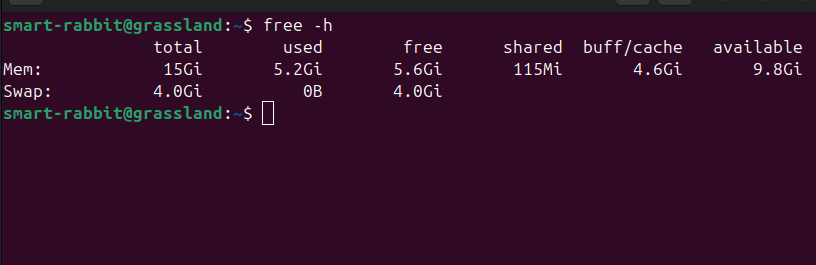

### Explanation
`free` displays memory usage statistics.

`-h option` shows values in human-readable format (MB/GB).

## 7. Disk Space Inspection

### Command used
```Commands
df -h ~
```
### Output
```terminaloutput
smart-rabbit@grassland:~$ df -h ~
Filesystem      Size  Used Avail Use% Mounted on
/dev/nvme0n1p6  144G   31G  107G  23% /
smart-rabbit@grassland:~$ 
```
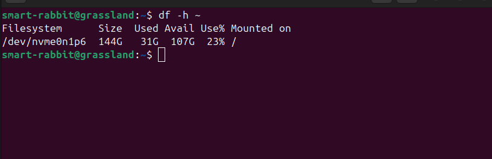

### Explanation
`df` displays filesystem disk space usage. This command shows the disk usage of the filesystem where the home directory resides.

## 8. Shell Identification

### Command used
```Commands
echo $SHELL
```
### Output
```terminaloutput
smart-rabbit@grassland:~$ echo $SHELL
/bin/bash
smart-rabbit@grassland:~$ 
```


### Explanation
`echo $SHELL` displays the shell used to start the current session.

## 9. Output Redirection

### Command used
```Commands
uname -a > system_report.txt
cat system_report.txt
```
### Output
```terminaloutput
smart-rabbit@grassland:~$ uname -a > system_report.txt
smart-rabbit@grassland:~$ cat system_report.txt
Linux grassland 6.14.0-37-generic #37~24.04.1-Ubuntu SMP PREEMPT_DYNAMIC Thu Nov 20 10:25:38 UTC 2 x86_64 x86_64 x86_64 GNU/Linux
smart-rabbit@grassland:~$ 
```
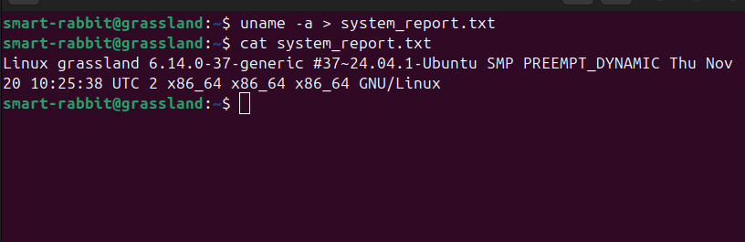

### Explanation

The output of the `uname -a command` is redirected into the file system_report.txt using the > operator.

## 10. Disk Usage Visualization (ncdu)

### Command used
```Commands
ncdu ~
```
### Output
```terminaloutput
ncdu 1.19 ~ Use the arrow keys to navigate, press ? for help
--- /home/smart-rabbit ----------------------------------------------------------
    7.6 GiB [###########] /apps
    3.0 GiB [####       ] /Downloads
    2.7 GiB [###        ] /.cache
  438.4 MiB [           ] /.config
  431.0 MiB [           ] /.local
  221.4 MiB [           ] /.nvm
  183.8 MiB [           ] /.m2
  173.3 MiB [           ] /snap
  104.0 MiB [           ] /.npm
   26.7 MiB [           ] /WebstormProjects
    3.6 MiB [           ] /Desktop
    2.2 MiB [           ] /Pictures
  460.0 KiB [           ] /.java
   96.0 KiB [           ] /javalearning
   76.0 KiB [           ] /.pki
   20.0 KiB [           ] /.vscode
............
```
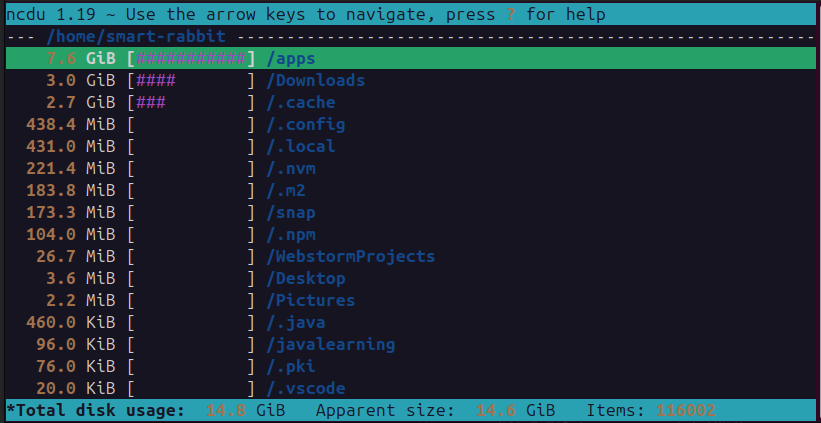

### Explanation
`ncdu (NCurses Disk Usage)` provides an interactive disk usage visualization of directories and files.
It helps identify which directories consume the most disk space in an easy-to-navigate interface.
